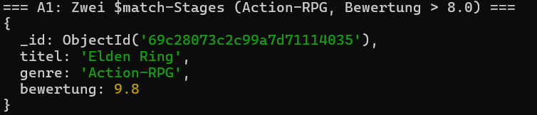
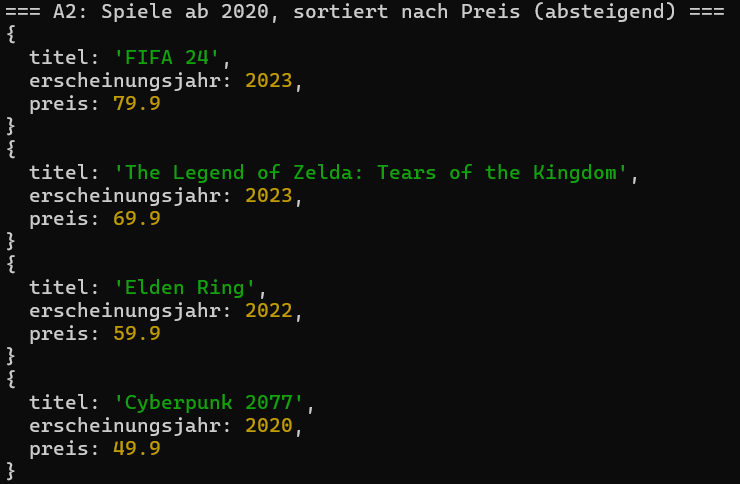
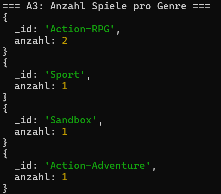
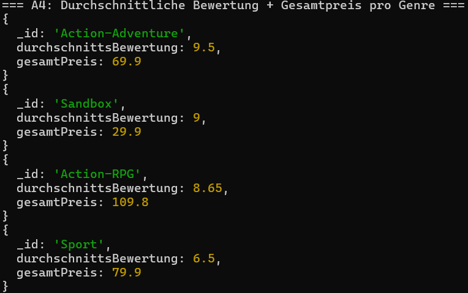
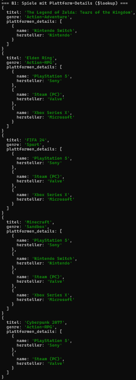
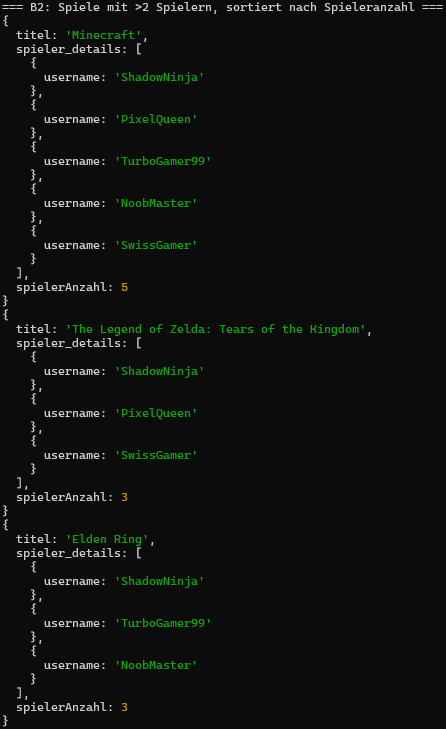
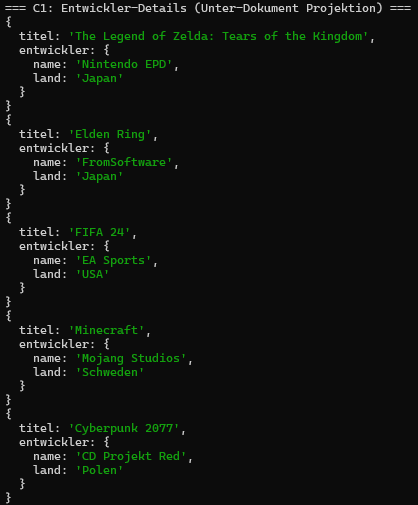
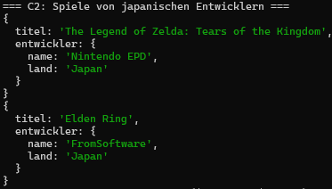
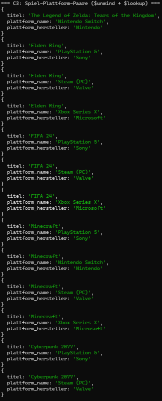

# KN-M-04: Datenmanipulation und Abfragen II

**Thema:** Videospiele & Gaming
**Datenbank:** `gamingDB`

---

## A) Aggregationen (50%)

### Script: [`aggregation_queries.js`](Dateien/aggregation_queries.js)

Das Script führt verschiedene Aggregations-Abfragen auf der Collection `spiele` aus:

| # | Was | Technik |
|---|-----|---------|
| A1 | Action-RPGs mit Bewertung > 8.0 | Zwei separate `$match`-Stages (statt `find()` aus KN-M-03) |
| A2 | Spiele ab 2020, sortiert nach Preis | `$match` + `$project` + `$sort` |
| A3 | Anzahl Spiele pro Genre | `$group` + `$sum` |
| A4 | Durchschnittsbewertung + Gesamtpreis pro Genre | `$group` + `$avg` + `$sum` |

**A1 — Zwei `$match`-Stages:**

```javascript
db.spiele.aggregate([
  { $match: { genre: "Action-RPG" } },
  { $match: { bewertung: { $gt: 8.0 } } },
  { $project: { _id: 1, titel: 1, genre: 1, bewertung: 1 } }
]);
```

**A2 — `$match` + `$project` + `$sort`:**

```javascript
db.spiele.aggregate([
  { $match: { erscheinungsjahr: { $gte: 2020 } } },
  { $project: { _id: 0, titel: 1, preis: 1, erscheinungsjahr: 1 } },
  { $sort: { preis: -1 } }
]);
```

**A3 — `$group` + `$sum`:**

```javascript
db.spiele.aggregate([
  { $group: { _id: "$genre", anzahl: { $sum: 1 } } },
  { $sort: { anzahl: -1 } }
]);
```

**A4 — `$group` + `$avg` + `$sum`:**

```javascript
db.spiele.aggregate([
  {
    $group: {
      _id: "$genre",
      durchschnittsBewertung: { $avg: "$bewertung" },
      gesamtPreis: { $sum: "$preis" }
    }
  },
  { $sort: { durchschnittsBewertung: -1 } }
]);
```

### Screenshots

**A1 — Zwei `$match`-Stages (Action-RPG, Bewertung > 8.0):**



**A2 — Spiele ab 2020, sortiert nach Preis:**



**A3 — Anzahl Spiele pro Genre:**



**A4 — Durchschnittliche Bewertung + Gesamtpreis pro Genre:**



---

## B) Join-Aggregation (30%)

### Script: [`aggregation_queries.js`](Dateien/aggregation_queries.js)

| # | Was | Technik |
|---|-----|---------|
| B1 | Spiele mit Plattform-Details | `$lookup` (spiele → plattformen) + `$project` |
| B2 | Spiele mit >2 Spielern, sortiert | `$lookup` (spiele → spieler) + `$addFields` + `$match` + `$sort` |

**B1 — `$lookup` auf Plattformen:**

```javascript
db.spiele.aggregate([
  {
    $lookup: {
      from: "plattformen",
      localField: "plattform_ids",
      foreignField: "_id",
      as: "plattformen_details"
    }
  },
  {
    $project: {
      _id: 0,
      titel: 1,
      genre: 1,
      "plattformen_details.name": 1,
      "plattformen_details.hersteller": 1
    }
  }
]);
```

**B2 — `$lookup` auf Spieler mit Filterung:**

```javascript
db.spiele.aggregate([
  {
    $lookup: {
      from: "spieler",
      localField: "spieler_ids",
      foreignField: "_id",
      as: "spieler_details"
    }
  },
  { $addFields: { spielerAnzahl: { $size: "$spieler_details" } } },
  { $match: { spielerAnzahl: { $gt: 2 } } },
  { $sort: { spielerAnzahl: -1 } },
  {
    $project: {
      _id: 0,
      titel: 1,
      spielerAnzahl: 1,
      "spieler_details.username": 1
    }
  }
]);
```

### Screenshots

**B1 — Spiele mit Plattform-Details (`$lookup`):**



**B2 — Spiele mit >2 Spielern, sortiert nach Spieleranzahl:**



---

## C) Unter-Dokumente / Arrays (20%)

### Script: [`aggregation_queries.js`](Dateien/aggregation_queries.js)

| # | Was | Technik |
|---|-----|---------|
| C1 | Entwickler-Details anzeigen | `find()` mit Projektion auf Unter-Dokument |
| C2 | Spiele von japanischen Entwicklern | `find()` mit Filter auf `entwickler.land` |
| C3 | Spiel-Plattform-Paare (flach) | `$unwind` + `$lookup` |

**C1 — Projektion auf Unter-Dokument:**

```javascript
db.spiele.find(
  {},
  { _id: 0, titel: 1, "entwickler.name": 1, "entwickler.land": 1 }
);
```

**C2 — Filter auf Unter-Dokument-Feld:**

```javascript
db.spiele.find(
  { "entwickler.land": "Japan" },
  { _id: 0, titel: 1, "entwickler.name": 1, "entwickler.land": 1 }
);
```

**C3 — `$unwind` + `$lookup`:**

```javascript
db.spiele.aggregate([
  { $unwind: "$plattform_ids" },
  {
    $lookup: {
      from: "plattformen",
      localField: "plattform_ids",
      foreignField: "_id",
      as: "plattform"
    }
  },
  { $unwind: "$plattform" },
  {
    $project: {
      _id: 0,
      titel: 1,
      plattform_name: "$plattform.name",
      plattform_hersteller: "$plattform.hersteller"
    }
  }
]);
```

### Screenshots

**C1 — Entwickler-Details (Unter-Dokument Projektion):**



**C2 — Spiele von japanischen Entwicklern:**



**C3 — Spiel-Plattform-Paare (`$unwind` + `$lookup`):**



---

## Abgabe-Dateien

| Datei | Teil | Beschreibung |
|---|---|---|
| [`aggregation_queries.js`](Dateien/aggregation_queries.js) | A, B, C | Aggregationen, Joins, Unter-Dokumente/Arrays |
