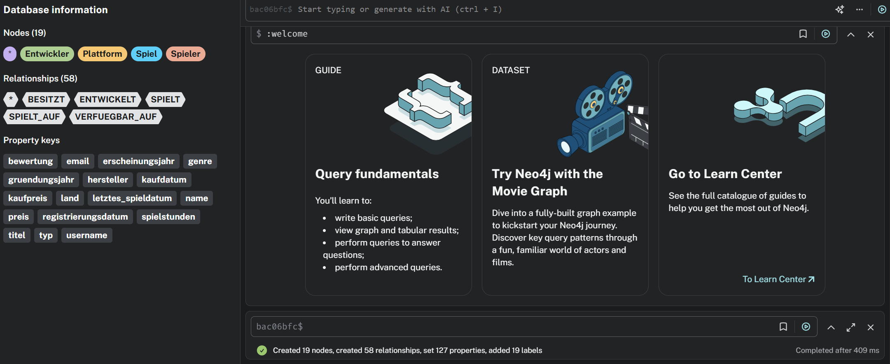
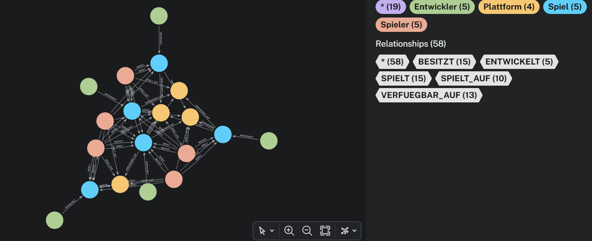
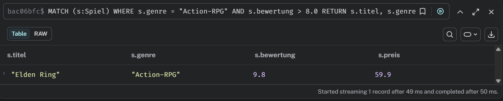
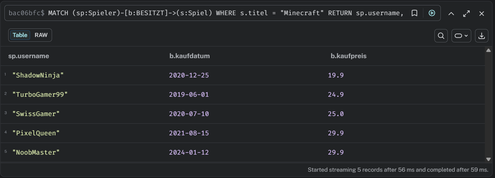
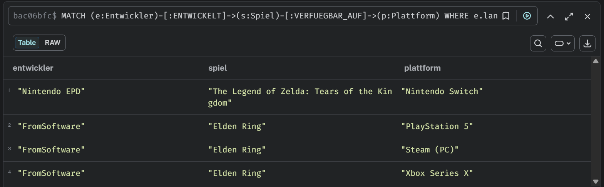
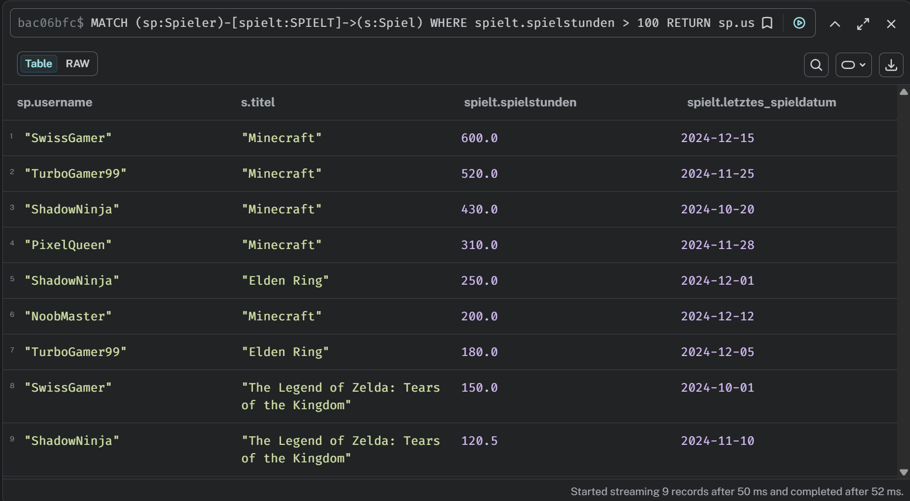

# KN-N-02: Datenabfrage und -Manipulation (Neo4j)

**Thema:** Videospiele & Gaming
**Datenbank:** Neo4j AuraDB (Cypher)

---

## A) Daten hinzufügen (20%)

### Script: [`a_insert_data.txt`](Dateien/a_insert_data.txt)

Ein einziges grosses `CREATE`-Statement, das alle Knoten und Beziehungen auf einmal erstellt:

| Knoten | Anzahl |
|---|---|
| `:Entwickler` | 5 |
| `:Spiel` | 5 |
| `:Spieler` | 5 |
| `:Plattform` | 4 |

| Beziehung | Attribute | Anzahl |
|---|---|---|
| `:ENTWICKELT` | — | 5 |
| `:VERFUEGBAR_AUF` | — | 13 |
| `:BESITZT` | kaufdatum, kaufpreis | 15 |
| `:SPIELT` | spielstunden, letztes_spieldatum | 15 |
| `:SPIELT_AUF` | — | 10 |

### Screenshots

Ausführung des CREATE-Statements — 19 Knoten, 58 Beziehungen erstellt:



---

## B) Daten abfragen (20%)

### Script: [`b_query_data.txt`](Dateien/b_query_data.txt)

### OPTIONAL MATCH erklärt

```cypher
MATCH (n)
OPTIONAL MATCH (n)-[r]->(m)
RETURN n, r, m
```

- `MATCH (n)` findet alle Knoten.
- `OPTIONAL MATCH` versucht für jeden Knoten eine ausgehende Beziehung zu finden.
- Wenn **keine** Beziehung existiert, werden `r` und `m` als `NULL` zurückgegeben — der Knoten bleibt im Ergebnis.
- Bei einem normalen `MATCH` würde der Knoten komplett aus dem Ergebnis fallen.
- Vergleichbar mit einem **LEFT JOIN** in SQL.

### 4 Query-Szenarien

| # | Beschreibung | WHERE | Technik |
|---|---|---|---|
| Q1 | Action-RPGs mit Bewertung > 8.0 | `s.genre = "Action-RPG" AND s.bewertung > 8.0` | WHERE auf Knoten |
| Q2 | Welche Spieler besitzen Minecraft und was haben sie bezahlt? | `s.titel = "Minecraft"` | Kanten-Attribute + WHERE |
| Q3 | Plattformen für Spiele japanischer Entwickler | `e.land = "Japan"` | Multi-Hop-Traversal |
| Q4 | Spieler mit > 100 Spielstunden, sortiert | `spielt.spielstunden > 100` | WHERE auf Kante + ORDER BY |

### Screenshots

OPTIONAL MATCH — alle Knoten mit ihren Beziehungen (Graph-Ansicht):



Q1 — Action-RPGs mit Bewertung > 8.0 (nur Elden Ring mit 9.8):



Q2 — Alle Spieler die Minecraft besitzen mit Kaufpreis:



Q3 — Plattformen für Spiele japanischer Entwickler:



Q4 — Spieler mit mehr als 100 Spielstunden, sortiert:



---

## C) Daten löschen (20%)

### Script: [`c_delete_data.txt`](Dateien/c_delete_data.txt)

### Ohne DETACH — Fehler

```cypher
MATCH (sp:Spieler {username: "NoobMaster"})
DELETE sp
```

**Ergebnis:** Fehler — `Cannot delete node, because it still has relationships.`
Neo4j erlaubt es nicht, einen Knoten zu löschen, der noch Beziehungen hat.

### Mit DETACH DELETE — Erfolg

```cypher
MATCH (sp:Spieler {username: "NoobMaster"})
DETACH DELETE sp
```

**Ergebnis:** Knoten wird gelöscht, zusammen mit allen seinen Beziehungen (`:BESITZT`, `:SPIELT`, `:SPIELT_AUF`).

### Screenshots

<!-- Screenshot: DELETE ohne DETACH (Fehler) -->

<!-- Screenshot: DETACH DELETE (Erfolg) -->

<!-- Screenshot: Kontrolle — NoobMaster existiert nicht mehr -->

---

## D) Daten verändern (20%)

### Script: [`d_update_data.txt`](Dateien/d_update_data.txt)

| # | Was | Cypher-Technik |
|---|---|---|
| U1 | ShadowNinja ändert Username und Email | `SET` auf Knoten-Attributen |
| U2 | Cyberpunk 2077 Preis wird auf 19.90 reduziert (Sale) | `SET` auf Knoten-Attribut |
| U3 | SwissGamer Spielstunden und Datum für Minecraft aktualisieren | `SET` auf `:SPIELT`-Kante |

### Screenshots

<!-- Screenshot: U1 — Username und Email geaendert -->

<!-- Screenshot: U2 — Preis reduziert -->

<!-- Screenshot: U3 — Kanten-Attribute aktualisiert -->

---

## E) Zusätzliche Klauseln (20%)

### Script: [`e_additional_clauses.txt`](Dateien/e_additional_clauses.txt)

### 1) MERGE — Upsert-Pattern

`MERGE` prüft, ob ein Knoten oder eine Beziehung bereits existiert:
- **Falls ja:** wird der bestehende zurückgegeben (kein Duplikat)
- **Falls nein:** wird ein neuer erstellt

Mit `ON CREATE SET` und `ON MATCH SET` kann man unterschiedliche Aktionen für beide Fälle definieren.

```cypher
MERGE (p:Plattform {name: "Steam (PC)"})
ON CREATE SET p.hersteller = "Valve", p.typ = "PC"
ON MATCH SET p.typ = "PC"
RETURN p
```

### 2) WITH — Pipeline zwischen Query-Teilen

`WITH` leitet Ergebnisse von einem Query-Teil an den nächsten weiter. Ermöglicht es, komplexe Abfragen in logische Schritte aufzuteilen.

```cypher
MATCH (sp:Spieler)-[b:BESITZT]->(s:Spiel)
WITH sp, count(b) AS anzahl_spiele
WHERE anzahl_spiele > 2
MATCH (sp)-[b:BESITZT]->(s:Spiel)
RETURN sp.username, anzahl_spiele, s.titel, b.kaufpreis
```

### Screenshots

<!-- Screenshot: MERGE — bestehende Plattform (kein Duplikat) -->

<!-- Screenshot: MERGE — neue Plattform erstellt -->

<!-- Screenshot: WITH — Spieler mit mehr als 2 Spielen -->

---

## Abgabe-Dateien

| Datei | Teil | Beschreibung |
|---|---|---|
| [`a_insert_data.txt`](Dateien/a_insert_data.txt) | A | Alle Knoten und Beziehungen erstellen (CREATE) |
| [`b_query_data.txt`](Dateien/b_query_data.txt) | B | OPTIONAL MATCH Erklärung + 4 Query-Szenarien |
| [`c_delete_data.txt`](Dateien/c_delete_data.txt) | C | DELETE vs. DETACH DELETE |
| [`d_update_data.txt`](Dateien/d_update_data.txt) | D | 3 Update-Szenarien (SET auf Knoten + Kante) |
| [`e_additional_clauses.txt`](Dateien/e_additional_clauses.txt) | E | MERGE + WITH erklärt mit Beispielen |
