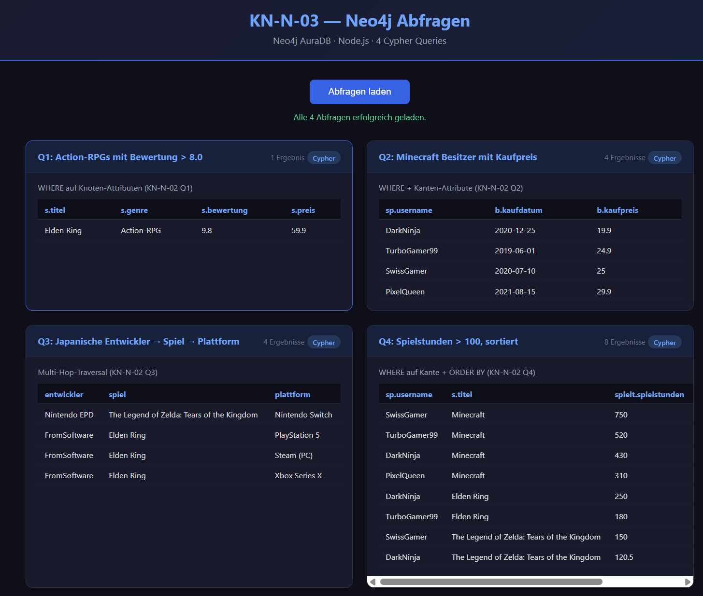

# KN-N-03: Programmierung mit Neo4j (Node.js)

**Thema:** Videospiele & Gaming
**Datenbank:** Neo4j AuraDB

---

## Setup

```bash
cd KN-N-03/Dateien
npm install
node app.js
```

Danach im Browser oeffnen: [http://localhost:3000](http://localhost:3000)

Die Web-App verwendet `express` als Webserver und `neo4j-driver` fuer die Datenbankverbindung. Per Klick auf "Abfragen laden" werden alle 4 Cypher-Queries ausgefuehrt und die Ergebnisse in Tabellen angezeigt.

---

## Abfragen

Die App fuehrt 4 Cypher-Abfragen aus (uebernommen aus KN-N-02 B):

| # | Was | Technik | Herkunft |
|---|-----|---------|----------|
| Q1 | Action-RPGs mit Bewertung > 8.0 | `WHERE` auf Knoten-Attributen | KN-N-02 Q1 |
| Q2 | Minecraft Besitzer mit Kaufpreis | `WHERE` + Kanten-Attribute | KN-N-02 Q2 |
| Q3 | Japanische Entwickler → Spiel → Plattform | Multi-Hop-Traversal | KN-N-02 Q3 |
| Q4 | Spielstunden > 100, sortiert | `WHERE` auf Kante + `ORDER BY` | KN-N-02 Q4 |

---

## Code

### [`app.js`](Dateien/app.js) — Express Server + Neo4j Queries

```javascript
const express = require("express");
const neo4j = require("neo4j-driver");
const path = require("path");

const app = express();
const PORT = 3000;

const driver = neo4j.driver(
  "neo4j+s://bac06bfc.databases.neo4j.io",
  neo4j.auth.basic("bac06bfc", "BZA6haKvdyzT0IwGnliqrTUrJsuokMpnTtdlcPico7Q")
);

app.use(express.static(path.join(__dirname, "public")));

// Helper: Neo4j-Typen (Integer, Date) in plain JS konvertieren
function toPlain(val) { ... }
function recordsToObjects(records) { ... }

app.get("/api/queries", async (req, res) => {
  const session = driver.session();
  const results = {};

  try {
    // Q1–Q4: Cypher-Abfragen ausfuehren
    // ...
    res.json(results);
  } catch (err) {
    res.status(500).json({ error: err.message });
  } finally {
    await session.close();
  }
});

app.listen(PORT, () => {
  console.log(`Server laeuft auf http://localhost:${PORT}`);
});
```

### [`public/index.html`](Dateien/public/index.html) — Frontend

Das Frontend zeigt die Ergebnisse in einer Card-Grid-Ansicht mit Tabellen an. Jede Karte zeigt eine Cypher-Query mit Beschreibung und Ergebnis-Tabelle.

---

## Screenshots

**Web-UI nach dem Laden der Abfragen:**



---

## Abgabe-Dateien

| Datei | Beschreibung |
|---|---|
| [`app.js`](Dateien/app.js) | Express Server mit 4 Neo4j Cypher-Abfragen als REST-API |
| [`public/index.html`](Dateien/public/index.html) | Frontend mit Card-Grid fuer Abfrage-Ergebnisse |
| [`package.json`](Dateien/package.json) | npm-Paketdefinition mit `neo4j-driver` + `express` |
